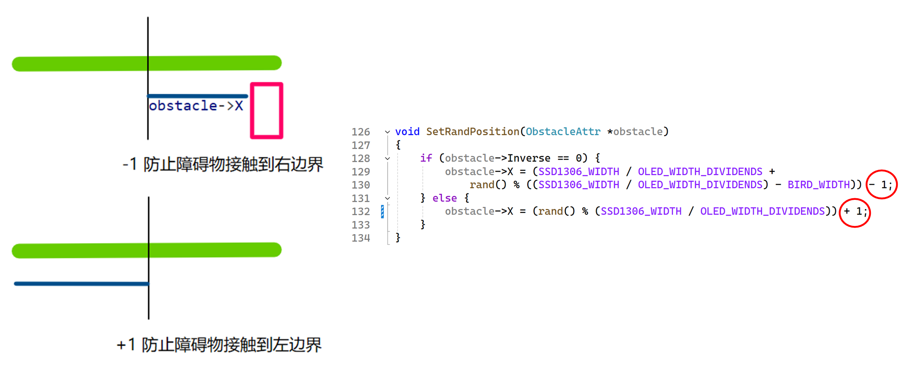
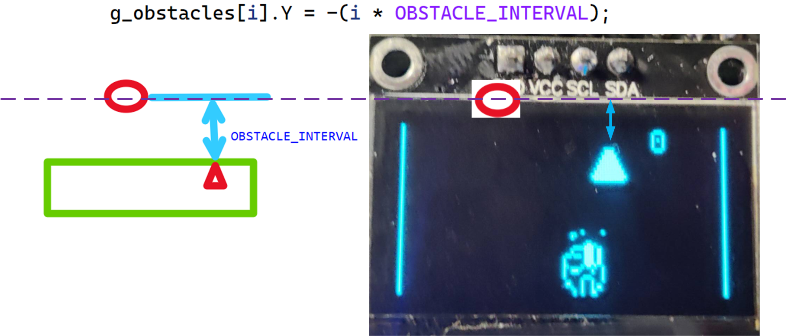
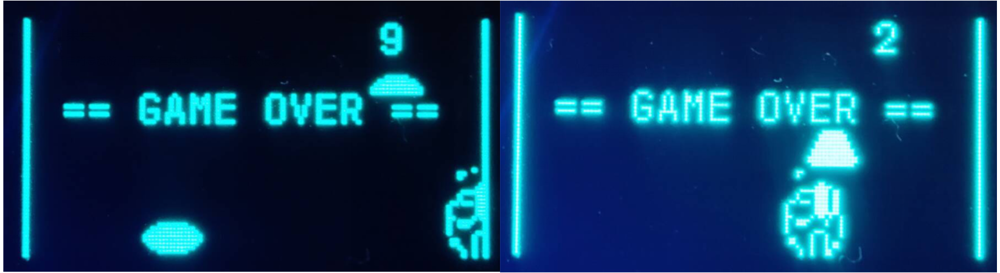
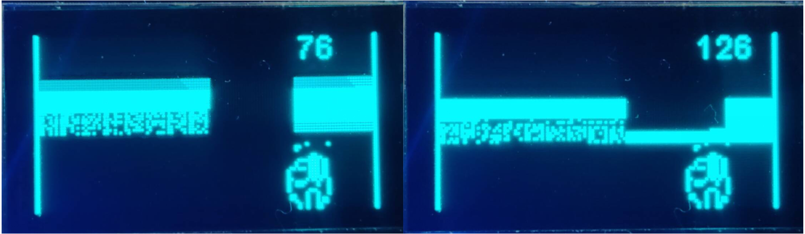

# 基于 HiSpark-Wifi-IoT 的 Flappy Bird 游戏设计与实现 🚀🐦

本次设计以经典游戏 **Flappy Bird** 为灵感，结合 **HiSpark-Wifi-IoT 开发平台**，成功设计并实现了一款嵌入式 Flappy Bird 游戏。

---

## ✨ 主要实现内容

在设计与实现过程中，主要完成了以下核心功能模块：

1.  **障碍物随机生成与智能布局**：
    *   实现了障碍物的动态、随机生成机制。
    *   采用随机数生成器，并结合自定义参数控制障碍物的位置与间距，确保游戏的可玩性与挑战性。
2.  **精准碰撞检测**：
    *   设计并优化了角色（小鸟）与障碍物之间的碰撞检测算法，保证了游戏判定的准确性。
3.  **创新激光互动功能**：
    *   引入了激光元素，并设计了激光与障碍物之间的碰撞逻辑，为游戏增添了新的互动维度和策略性。
4.  **沉浸式音效体验**：
    *   实现了基于 PWM (脉宽调制) 技术的音符生成与背景音乐播放机制，显著增强了游戏的互动性和趣味性。
5.  **物理按键输入处理**：
    *   利用电压分压原理，将按键产生的模拟信号准确转换为数字信号，以识别按键的按下状态，实现游戏角色的控制。

---

## 🛠️ 关键技术点解析

### 障碍物设计与生成逻辑

为了确保生成的障碍物在游戏界面内合理分布，避免触碰到屏幕的左右边界，对障碍物的生成位置进行了设计。

*   **随机数种子初始化**：
    在首次使用 `rand()` 函数生成随机数之前，我们通过调用 `srand(time(NULL));` 来设置随机数生成器的种子。
    *   `time(NULL)` 函数返回自 1970 年 1 月 1 日 00:00:00 UTC 以来的总秒数。由于每次程序运行时这个时间戳通常是不同的，因此可以确保每次游戏启动时生成的随机数序列都具有良好的随机性，从而使障碍物的出现模式多样化。

*   **障碍物细节与问题记录**：
    *   **X 坐标取值逻辑**：下图展示了障碍物 X 坐标的取值逻辑，确保障碍物在有效区域内生成。
        
    *   **生成间隔控制**：
        
    *   **碰撞检测原理**：无论障碍物的视觉外观如何，系统均将其视为矩形进行碰撞检测，以简化计算并保证性能。
        
    *   **开发问题记录 - 管道障碍物**：在将障碍物从小形状修改为条状的管道形状时，遇到并解决的相关问题记录。
        

---